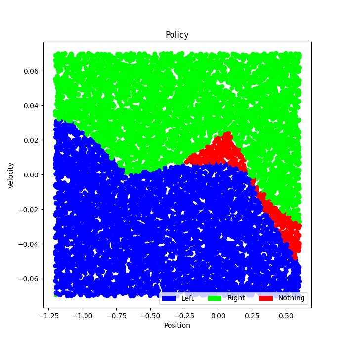

# RL_playground
## Some educational reinforcement learning mini projects

## 1- MountainCar-v0
### Vanilla Q-learning:
run :
`python3 MountainCar_QLearning.py --help`
 
#### No Decay:

#### Exponential Decay:

#### Visiting Number Decay:

#### Success:

### 2- DQN:
Reinforcement Learning DQN - using OpenAI gym Mountain Car
- Keras and pytorch
- gym

#### Models
Keras and pytorch

Trained models

-`path = './output/MountainCar_DQN-2020-10-09_23-00_pytoch'`
-`path = './output/MountainCar_DQN-2020-10-09_22-52_pytorch_modif_reward'`
-`path = "./output/MountainCar_DQN-2020-10-08_20-12_keras"`

#### Pytorch
With original reward

Visualize Policy after training with original reward

We can see the policy by plotting the agent’s choice over a combination of positions and velocities. You can see that the agent learns to, *usually*, move left when the car’s velocity is negative and then switch directions when the car’s velocity becomes positive with a few position and velocity combinations on the left side of the environment where the agent will do nothing.

Around episode 1000 the agent begins to successfully complete episodes,

With modified reward

Visualize Policy after training with new reward

The learned policy can be clearly visualized in the plot below. The agent learns to move left when the car's velocity is negative and then switch directions when the car's velocity becomes positive with a few position and velocity combinations on the far left of the environment where the agent will do nothing.

Around episode 330 the agent begins to successfully complete episodes, and around episode 400, the agent completes almost every episode successfully.

#### Keras
Visualize Policy after training

2 Layer NN

#### How to train
-create a model e.g

`agent = DQN(episodes=1000, epsilon=0.3, gamma=0.99, learning_rate = 0.001, iteration_num=200, pytorch=True, epsilon_decay=0.95, epsilon_decay_type='exponential', original_reward=False)`

-train

`_rewards_by_episode,qnetwork, configs = agent.train()`

#### How to test
-test

`agent = DQN(episodes=1000, epsilon=0.3, gamma=0.99, learning_rate = 0.001, iteration_num=200, pytorch=True, epsilon_decay=0.95, epsilon_decay_type='exponential', original_reward=False)`
`agent.test(os.path.join(agent.path, 'trainNetworkInEPS{}last.pth'.format(agent.episodes_num)))`
`agent.path = './output/MountainCar_DQN-2020-10-09_22-52_pytorch_modif_reward'`

